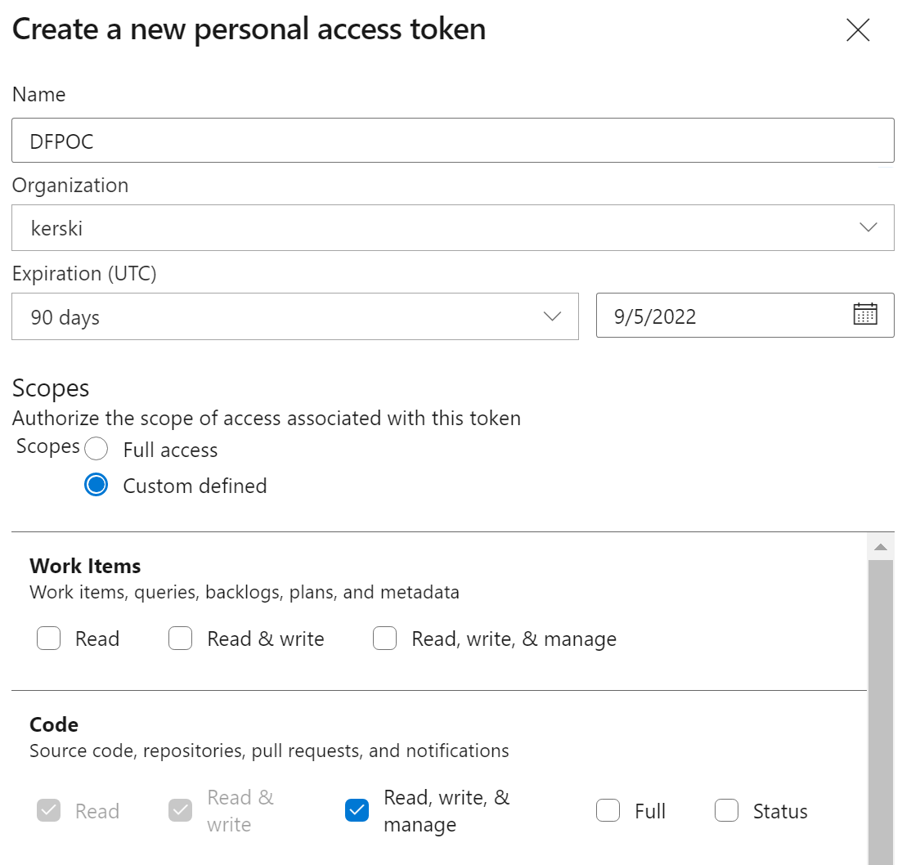
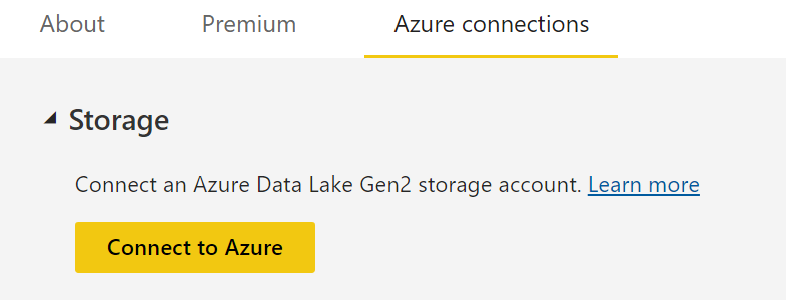
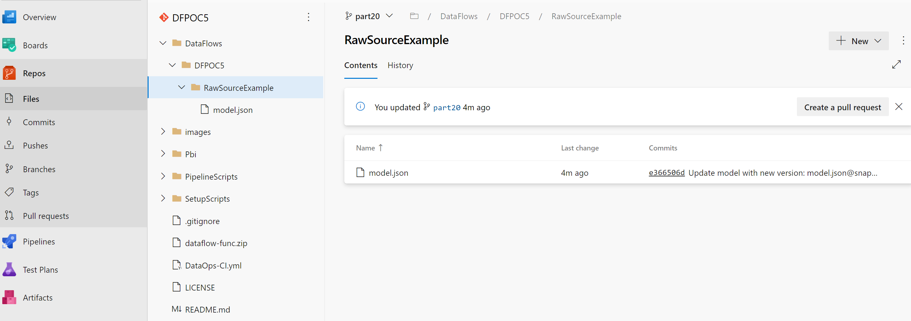
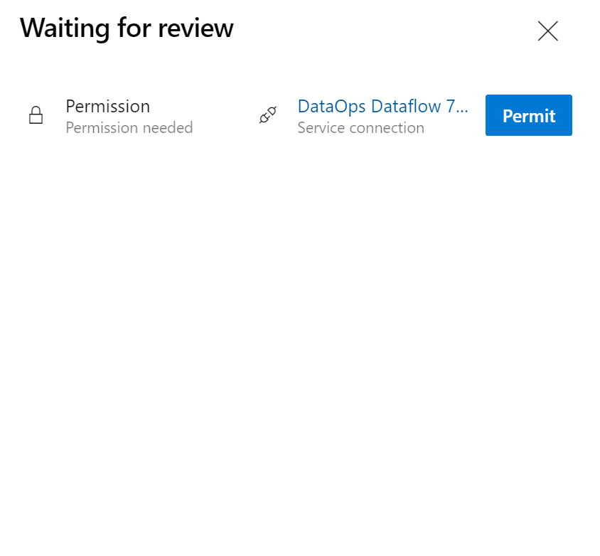

# Part 22 of "Bringing DataOps to Power BI" this branch serves to provides templates for applying DataOps principles.

These instructions are a continuation from <a href="https://www.kerski.tech/bringing-dataops-to-power-bi-part22/" target="_blank">Part 22 of Bringing DataOps to Power BI</a>.  The steps below describe how to setup a DevOps project with Azure resources that will automatically save Power BI dataflow code in Git and shows you how to run tests using Pester/Gherkin locally and automating those tests in Azure DevOps.

> ***Important Note #1**: This guide is customized to Power BI for U.S. Commercial environment. If you are trying to set this up for another Microsoft cloud environment (like U.S. Gov Cloud), please check Microsoft's documentation for the appropriate URLs. They will be different from the U.S. Commercial environment.*

> ***Important Note #2**: This guide uses scripts that I built and tested on environments I have access to. Please review all scripts if you plan for production use, as you are ultimately responsible for the code that runs in your environment.*

## Table of Contents

1. [Prerequisites](#Prerequisites)
1. [Installation Steps](#Installation-Steps)
1. [Checking the dataflow pushed to Azure DevOps
](#Checking-the-dataflow-pushed-to-Azure-DevOps)
1. [Cloning the Repository and Run Tests](#CloningtheRepositoryandRunTests)

## Prerequisites

### Power BI and Azure
-   Power BI Premium Per User license assigned to a service account. If you do not have a Premium Per User license, use the "Buy Now" feature on <a href="https://docs.microsoft.com/en-us/power-bi/admin/service-premium-per-user-faq" target="_blank">Microsoft's site</a> or if you don't have access to do that, please contact your administrator (be nice!).

-  Identify the location of your Power BI Service. Please see instructions <a href="https://docs.microsoft.com/en-us/power-bi/admin/service-admin-where-is-my-tenant-located" target="_blank">at this link</a>.  You'll need to convert the readable name to Azure name when prompted to enter the location.  For example, West US 2 would be 'westus2'.

-   Azure subscription created and you have Owner rights to the subscription.

- A PAT token generated with Code "Read, Write, Manage" Permissions.  Please see instructions <a href="https://docs.microsoft.com/en-us/azure/devops/organizations/accounts/use-personal-access-tokens-to-authenticate?view=azure-devops&tabs=Windows#create-a-pat" target="_blank">at this link</a>.

    

### Desktop

-  <a href="https://docs.microsoft.com/en-us/cli/azure/install-azure-cli" target="_blank">Azure CLI</a> version 2.37 installed.

- <a href="https://code.visualstudio.com/download" target="_blank">Visual Studio Code</a> installed.  It's free and a great tool for development.

- <a href="https://code.visualstudio.com/docs/editor/github" target="_blank">Install GitHub Pull Requests and Issues extension</a>.

-  <a href="https://docs.microsoft.com/en-us/powershell/scripting/install/installing-powershell-on-windows?view=powershell-7.2" target="_blank">PowerShell 7</a> installed.  If you are using Windows 10 or 11, this should be installed already. For the purposes of the instructions I'm going to use PowerShell ISE to run a PowerShell script. 

- Via the PowerShell terminal install Pester 4

    Install-Module -Name Pester -RequiredVersion 4.6.0

### Azure DevOps

-  Signed up for <a href="https://docs.microsoft.com/en-us/azure/devops/user-guide/sign-up-invite-teammates?view=azure-devops" target="_blank">Azure DevOps</a>.

- For Azure DevOps you must be a member of the Project Collection Administrators group, the Organization Owner, or have the Create new projects permission set to Allow. 

## Installation Steps

1. Open PowerShell Version 7 and enter the following script:
    > Invoke-WebRequest -Uri "https://raw.githubusercontent.com/kerski/pbi-dataops-template/part22/SetupScripts/PremiumPerUser/DataFlows/Setup-Dataflow-PPU.ps1" -OutFile "./Setup-Dataflow-PPU.ps1"
    
1. This will download the setup scripts to the current folder.  Run ".\Setup-Dataflow-PPU.ps1" in PowerShell.

1. During the install process you will be prompted to enter the following information:

    - The name of the subscription you have in Azure.
    - The location of your Power BI service (see Prequisites)
    - The name of the project you wish to create in Azure DevOps. 
    - The PAT Token (see Prequisites)
    - The name of the Power BI workspace you wish to create.
    - The name (UPN/email) of the Service account you created in the Prerequisites section.

1. During the course of the install you will be prompted to enter your Microsoft 365 credentials. Depending on your environment you may have a browser tab appear to sign-in. After signing in you can return to the PowerShell window. In addition, if you don't have the Power BI Management Shell or Azure DevOps CLI package installed, you will be asked to install.  Please affirm you wish to install those packages if prompted.

    

1. Near the end of the installation you will see the message that starts with "NEED ASSISTANCE".

    

As of June 2022, you cannot easily script the connection between a workspace and Azure Gen2 Data Lake, so please navigate to the newly created workspace and <a href="https://docs.microsoft.com/en-us/power-bi/transform-model/dataflows/dataflows-azure-data-lake-storage-integration#prerequisites" target="_blank">follow these instructions</a> to make the connection.

   

***Important Note #3**: I have seen that permission settings in the storage account can take up to 10-15 minutes to take affect.  Consequently, this causes you to get an Access Denied message during this step.  Try a few times (rule of thumb 3).*

6. If the script runs successfully you will be presented with a message similar in the image below. 

    

## Checking the Dataflow pushed to Azure DevOps

With the [Installation Steps](#Installation-Steps) complete, the Azure resource should have automatically picked up on the new dataflow and pushed it to Git. 

1. Please navigate to the Repos section of the Azure DevOps project.  Switch to the 'part22' branch in the Repo and you should see a 'DataFlows' folder that contains the newly pushed 'model.json' file that represents the dataflow.  The image below is an example. 

2. Next navigate to the pipelines and you will see that the first pipeline is paused.  This is because we need to authorize the use of the service connection.  Click on the paused pipeline and you will see a prompt to "This pipeline needs permission to access a resource before this run can continue".  Click the "View" button.

3. Click the "Permit" button and select "Permit" again when the pop-up is presented.

Don't worry about the pipeline running we need to make a few more updates.  Please see the next section.

## Cloning the Repository and Run Tests

With the [Installation Steps](#InstallationSteps) complete, you will need to follow the steps below to work with the project locally and run tests.

1. Navigate to the project in Azure DevOps. Click on the Repos section and select the Clone button (outlined in orange in the image below).

 

2. Click the "Clone in VS Code" button.

 

3. You may be prompted by a couple of pop-ups.  Please accept.

 

4. Next you will be prompted to select where you want to clone the repository on your computer.

5. If all goes well, Visual Studio Code will open and you will be prompted to open the project.  I suggest clicking the "Open in New Window" button.

 

6. Make sure to switch the branch to "part22". You can do that by clicking the branch button on the bottom left of Visual Studio Code and then select the "part22" branch when prompted by a dropdown.

 

7. Now it's time to setup the test files.  Cut the folder "CI" found in SetupsScripts\PremiumPerUser\DataFlows and paste to DataFlows\{Workspace}\RawSourceExample.  Remember cut not copy, otherwise the tests will run twice.

 

8. Open the RawSourceExample.feature file and update the {SUB_NAME} placeholder with the subscription name, {STORAGE_ACCOUNT_NAME} placeholder with the storage account name, and the {WORKSPACE_NAME} placeholder with the workspace that was created.  All this information is created during the [Installation Steps](#InstallationSteps)

 

9. Save the file.

10. Then go to the terminal window within Visual Studio Code (near the bottom on your screen) and type "Invoke-Gherkin".  The tests should run and you should see a screen similar to this:

 

11. Commit and push the changes to Azure DevOps and this will kick off the pipeline.

 

12. Navigate to Azure DevOps and see the results of the pipeline.

 

13. Navigate to the "Test Plans" section of Azure DevOps and locate the published test results under the "Runs" subsection in the navigation.

 

14. Here you can view all the test results and prior test results ran by the pipeline.

 