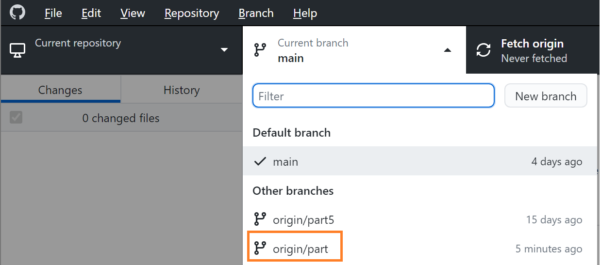
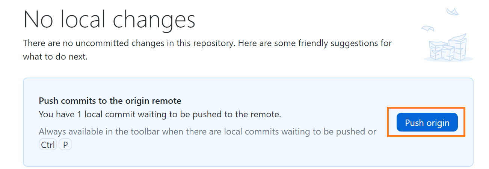
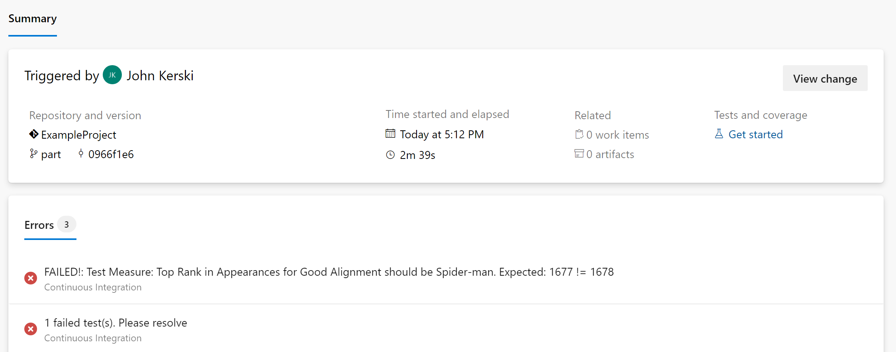

# Part 5 of "Bringing DataOps to Power BI" this branch serves to provides templates for applying DataOps principles.

These instructions are a continuation from <a href="https://www.kerski.tech/bringing-dataops-to-power-bi-part5/" target="_blank">Part 5 of Bringing DataOps to Power BI</a>.  The steps below describe how to setup a DevOps project with a pipeline that tests and deploys a Power BI report.

> ***Important Note #1**: This guide is customized to Power BI for U.S. Commercial environment. If you are trying to set this up for another Microsoft cloud environment (like U.S. Gov Cloud), please check Microsoft's documentation for the appropriate URLs. They will be different from the U.S. Commercial environment.*

> ***Important Note #2**: This guide uses scripts that I built and tested on environments I have access to. Please review all scripts if you plan for production use, as you are ultimately response for the code that runs in your environment.*

## Table of Contents

1. [Prerequisites](#Prerequisites)
1. [Installation Steps](#Installation-Steps)
1. [Priming the Pipeline](#Priming-the-Pipeline)
1. [Running the Pipeline](#Running-the-Pipeline)
1. [Failed Pipeline](#Failed-Pipeline-Example)

## Prerequisites

### Power BI
-   Power BI Premium Per User license assigned to a service account. If you do not have a Premium Per User license, use the "Buy Now" feature on <a href="https://docs.microsoft.com/en-us/power-bi/admin/service-premium-per-user-faq" target="_blank">Microsoft's site</a> or if you don't have access to do that, please contact your administrator (be nice!).

### Desktop

-  <a href="https://docs.microsoft.com/en-us/cli/azure/install-azure-cli" target="_blank">Azure CLI</a> installed.

-  <a href="https://docs.microsoft.com/en-us/powershell/scripting/install/installing-powershell-on-windows?view=powershell-7.2" target="_blank">PowerShell 7</a> installed.  If you are using Windows 10 or 11, this should be installed already. For the purposes of the instructions I'm going to use PowerShell ISE to run a PowerShell script. 

-   <a href="https://desktop.github.com/" target="_blank">GitHub desktop</a> installed.

-   Power BI Desktop installed on device executing these steps.

### Azure DevOps

-  Signed up for <a href="https://docs.microsoft.com/en-us/azure/devops/user-guide/sign-up-invite-teammates?view=azure-devops" target="_blank">Azure DevOps</a>.

- For Azure DevOps you must be a member of the Project Collection Administrators group, the Organization Owner, or have the Create new projects permission set to Allow. 

## Installation Steps

### Create Power BI Workspaces and Create Azure DevOps project
1. Open PowerShell ISE and enter the followinging script:
    > Invoke-WebRequest -Uri "https://raw.githubusercontent.com/kerski/pbi-dataops-template/part5/SetupScripts/PremiumPerUser/Setup-PPU.ps1" -OutFile "./Setup-PPU.ps1"

1. Highlight the code and select "Run Selection" (outlined in orange in the image below).

    

1. This will download the setup script to the current folder.  Open the file "Setup-PPU.ps1" in PowerShell ISE.

1. Highlight the code and select "Run Selection" (outlined in orange in the image below).

    

1. During the install process you will be prompted to enter the following information:

    - The name of the build workspace you wish to create in the Power BI Service.
    - The name of the development workspace you wish to create in the Power BI Service.
    - The name (UPN/email) of the Service account you created in the Prerequisites section.
    - The password for the (UPN/email). ***Important Note**: This scripts assumes PowerShell Version 5.1, so this password WILL NOT be masked. Make sure to protect this password from someone snooping behind you.* 
    - The name of the project you wish to create in Azure DevOps.

    

1. During the course of the install you will be prompted to enter your Microsoft 365 credentials. Depending on your environment you may have a browser tab appear to sign-in. After signing in you can return to the Powershell ISE window. In addition, if you don't have the Power BI Management Shell or Azure DevOps CLI package installed, you will be asked to install.  Please affirm you wish to install those packages if prompted.

    

1. If the script runs successfully you will be presented with a message similar in the image below. 

    

## Priming the Pipeline

As stated in <a href="https://www.kerski.tech/bringing-dataops-to-power-bi-part5/" target="_blank">Part 5 of Bringing DataOps to Power BI</a> the data source credentials have to be manually set in order for the pipeline to be automated.  This is based on Power BI's architecture as of August 2021.  Please take the following steps to setup the credentials for the SampleModel.pbix file found within this project.

1. Navigate to <a href="https://app.powerbi.com" target="_blank">app.powerbi.com</a> and go the workspace you named in step 5 on the [Installation Steps](#InstallationSteps). Find the dataset and select the 'Settings' option (example outlined in orange in the image below).

    

1. Expand the 'Data source credentials' section and select 'Edit Credentials' link (outlined in orange in the image below).
    

1. Select the Authentication method as "Anonymous" and Privacy level to "None" and then press the "Sign in" button.

    

## Running the Pipeline

With the [Installation Steps](#InstallationSteps) and [Priming the Pipeline](#PrimingthePipeline) steps complete, you will need to follow the steps below to work with the project locally, make a change to a Power BI file, commit it to the repository in Azure DevOps, and see the pipeline in action.

1. Copy the URL and navigate the project in Azure DevOps. Click on the Repos section and select the Clone button (outlined in orange in the image below).

 

2.  Copy the textbox under the 'Command line' label. I suggest copying to Notepad temporarily as you'll have two other text fields to copy (outlined in orange in the image below).

 

3. Press the "Generate Git Credentials" button.

 

4. Copy the Username and Password to Notepad temporarily.

5. Open GitHub Desktop and select clone reposistory (outlined in orange in the image below).

6. Paste the URL copied in step 2.

 

7. You will then be prompted to enter the username and password credentials you copied in Step 4.

 

8. Within GitHub Desktop switch the branch from main to 'origin/part5'.  I ask you to do this because in subsequent blog series, I'll have separate branches that will introduce new features that follow DataOps priniciples.

9. Within File Explorer (for Windows) navigate to the project folder that was cloned and within that folder navigate to Pbi->SampleModel->SampleModel.pbix and open the pbix file.

10. Navigate to the "Number of Characters" metric (outlined in orange in the image below) and remove "+ 0" from the measure (outlined in purple in the image below).  Then save the changes.  This demonstrates a change made to the Power BI file by a developer.

11. Navigate back to GitHub Desktop and press "Commit to part5" (outlined in orange in the image below).

12. Then select the "Push origin" button.  This will push the changes to Azure DevOps and kick-off the pipeline.

13. Navigate back to Azure DevOps and you should see the pipeline in progress.  This is typically donated by the a blue clock icon.  Press the pipeline link (outlined in orange in the image below).

14. This page will show you the latest status of the pipeline.  The example image below shows the commit you pushed to Azure DevOps and that the pipeline is in progress.

15. Once the pipeline completes you should get a green checkmark icon.  You may also receive an email stating the pipeline successfully completed.

## Failed Pipeline Example

If a test case fails in the pipeline you will see a red x icon appear in the Azure DevOps Pipeline. 

If you click on the failed entry (outlined in orange in the image below) you will be presented with a screen providing details of the failed tests.

For example, in the image below you can see an example of the failed test.

