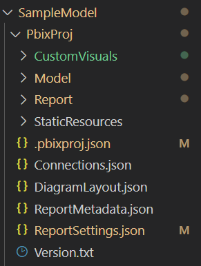

# Tracking Changes
This section covers how to track changes to .pbix files using pbi-tools. As stated on pbi-tools's site:
"pbi-tools solves a long-standing problem in the Power BI development community. It provides tools to bring Power BI projects under source control, enabling professional development workflows and enhanced governance. Available for free and with open source code (MIT License) on GitHub."

## Table of Contents

1. [Prerequisites](#prerequisites)
2. [Steps to Track Changes](#steps-to-track-changes)
3. [Contents of the PbixProj Folder]()

## Prerequisites

1.	[Clone the project](./clone-project.md)
2.	Install pbi-tools - Please make sure to complete step 4 (Add the tool folder to your path environment setting). This will make running pbi-tools much easier moving forward.
    - pbi-tools requires Windows 64-bit and Power BI Desktop installed on the machine running pbi-tools. 
    - *Please do NOT install Power BI Desktop with the Microsoft Store. pbi-tools will not be able to interact with Power BI Desktop (as of Jan. 2023).*
    - Make sure to select "Edit environment variables for your account" (outlined in the image below).
 
## Steps to Track Changes

When updating Power BI files within this project, please tracks changes by following the steps below. 
1.	Open the project using Visual Studio Code.
2.	From Visual Studio Code please open the terminal menu option and select "New Terminal".

3.	From the terminal enter ./Watch-PBI.ps1 "{FileName}" where {FileName} is the name of the Power BI file in double quotes (example below).

  
4.	If the Power BI file is not opened already, it will launch Power BI Desktop and initiate the extract and watch. If the Power BI file is already opened it will immediately initiate the extract and watch.

5.	Now you can update the Power BI file and when you save the file locally (Ctrl+S), pbi-tools will automatically update the contents within the PbixProj folder identifying the changes.

# Contents of the PbixProj folder

Each sub-folder in the "Pbi" folder represents a single .pbix file that is stored in source control.  Within each sub-folder is a 'PbixProj' folder.  This folder contains the extracted contents of the .pbix file (example provided in the image below). 

The following provides my latest understanding of the folders and files within the 'PbixProj' folder.

- CustomVisuals - Identifies the custom visuals imported into the .pbix file.
- Model - This describes the tables, measures, and relationships in the .pbix file.
    - tables - Each table created within PowerQuery is represented by a folder.  Within each folder is a representation of the columns and measures associated with that table. 
    

- Report - This describes the visuals and filters separated by the tabs in the .pbix file.
    - sections - Each tab of the .pbix file is represented as a sub-folder.
        - sections/000_<Tab Name>
            - visualContainers - Contains a folder representing each visual on the tab.
                - visualContainers/_<Visual Name>
                    - config.json - Identifies all the format settings for that visual including the font, background colors, etc.
                    - filters.json - Identifies the filters in the filter pane under "Filters on this visual".
            - filters.json - Identifies the filters in the filter pane under "Filter on this page".
    - config.json - This file identifies what theme file is used and what is the default table used (activeSectionIndex).
    - filters.json - Identifies the filters in the filter pane under "Filter on all pages". 
- StaticResources - Contains the theme file used.
- DiagramLayout.json - Describes the orientation of the tables in the Model view.
- ReportMetadata/ReportSettings.json - Describes what version of Power BI was used to build the file and settings applied in the "Options and Settings" section of Power BI Desktop.